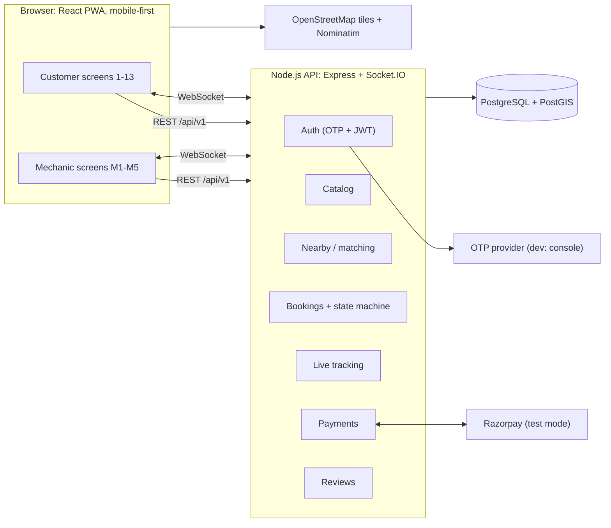
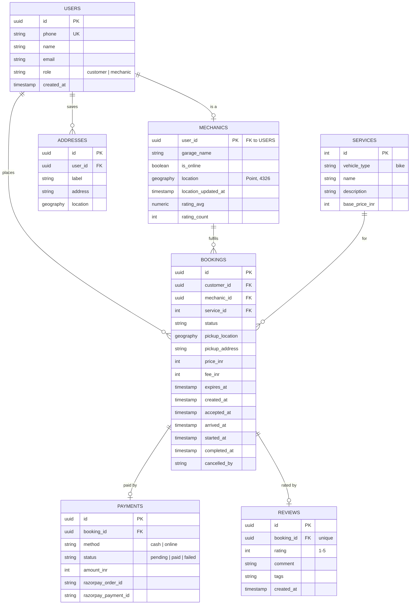
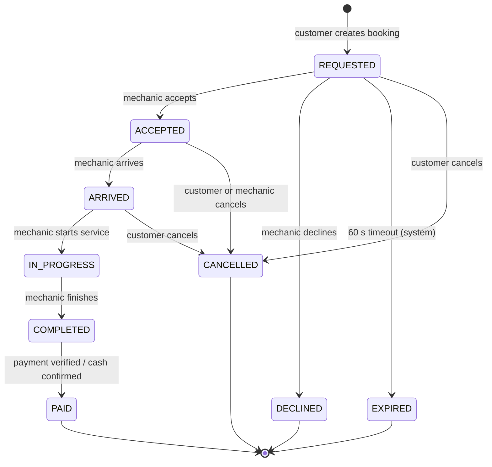
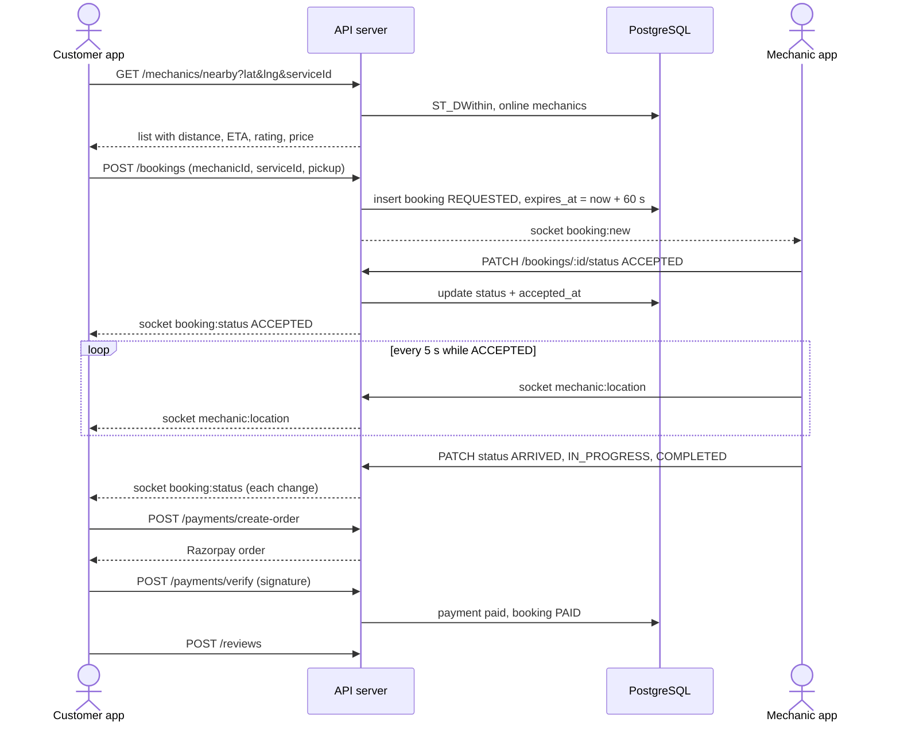

# 02 · Architecture: FixOnRoad

**Related:** [PRD](01-PRD.md) · [API Spec](03-API-SPEC.md) · [Requirements](04-REQUIREMENTS.md) · [Roadmap](05-ROADMAP.md)

> Diagrams below are Mermaid and render directly on GitHub.

---

## 1. System diagram



**Reading it:** one web app serves both roles. REST handles request/response actions, and WebSocket carries the realtime parts (new request, status changes, mechanic location). Every state change is written to PostgreSQL first, then broadcast.

---

## 2. Tech stack and why

| Layer | Choice | Why |
|---|---|---|
| Frontend | **React + Vite**, Tailwind CSS, installable **PWA** | Mobile-first UI that a judge can open from a URL, with no app-store step. Same code serves customer and mechanic views. |
| Maps | **Leaflet + OpenStreetMap**, Nominatim for geocoding | Free, no billing card. Enough for pins, routes and reverse geocoding. |
| Backend | **Node.js + Express**, **Socket.IO** | One language across the stack. Socket.IO gives rooms and reconnection for free. |
| Database | **PostgreSQL + PostGIS** | Relational data (bookings, payments) plus fast "within 5 km" queries with `ST_DWithin`. |
| Auth | **Phone OTP → JWT** | Matches how Indian users log in. Dev mode prints the OTP to the server console; a real SMS provider (e.g. MSG91) is optional later. |
| Payments | **Razorpay (test mode)** | Handles UPI, cards and wallets. Server-side signature verification. |
| Validation | **Zod** | One schema validates each request body. |
| Hosting | Frontend: **Vercel**. API: **Render**. DB: **Neon** (PostGIS available). | Free tiers, simple deploys. *(Verify free-tier limits at build time.)* |

**Fallback:** if PostGIS is unavailable, use a bounding-box + Haversine SQL query. The API contract does not change.

---

## 3. Modules and responsibilities

| Module | Responsibility |
|---|---|
| Auth | Send/verify OTP, issue JWT, role (`customer` / `mechanic`) |
| Catalog | List services with fixed prices |
| Nearby | Find online mechanics within a radius, compute distance and rough ETA |
| Bookings | Create requests, enforce the state machine, own timestamps |
| Tracking | Receive mechanic GPS via socket, relay to the booking room |
| Payments | Create Razorpay orders, verify signatures, confirm cash |
| Reviews | Store rating, update mechanic average |
| Expiry job | Every 10 s, mark `REQUESTED` bookings past `expires_at` as `EXPIRED` |

---

## 4. Data model



**Key constraints**
- `reviews.booking_id` is unique (one review per booking).
- A partial unique index allows only **one active booking per customer** (`status IN REQUESTED, ACCEPTED, ARRIVED, IN_PROGRESS`).
- `price_inr` and `fee_inr` are **copied onto the booking** at request time, so later catalog price changes never alter a past job.
- A GiST index on `mechanics.location` keeps nearby queries fast.

---

## 5. Booking state machine



| Transition | Who may trigger it |
|---|---|
| `REQUESTED → ACCEPTED / DECLINED` | The assigned mechanic |
| `REQUESTED → EXPIRED` | System job |
| `REQUESTED / ACCEPTED / ARRIVED → CANCELLED` | Customer (mechanic may cancel from `ACCEPTED`) |
| `ACCEPTED → ARRIVED → IN_PROGRESS → COMPLETED` | The assigned mechanic |
| `COMPLETED → PAID` | System (Razorpay verify) or mechanic (cash confirm) |

Any other transition returns **409 Conflict**. UI timeline mapping: *Mechanic reached* = `ARRIVED`, *Service in progress* = `IN_PROGRESS`, *Completed* = `COMPLETED`.

---

## 6. Key flow: request to completion



---

## 7. Real-time design

- **Socket.IO rooms:** `booking:{id}` (customer + assigned mechanic) and `mechanic:{id}` (incoming requests).
- Socket connections authenticate with the same JWT. A user may only join rooms for their own bookings.
- The mechanic client uses `navigator.geolocation.watchPosition` and emits a location at most every 5 s.
- The latest location is stored on the `mechanics` row. **History is not stored** in the MVP.
- **Fallback:** if the socket drops, the client polls `GET /bookings/:id` every 5 s.
- Event list is in the [API Spec](03-API-SPEC.md#realtime-events-socketio).

---

## 8. Security and privacy

| Concern | Decision |
|---|---|
| Authentication | OTP with rate limiting (max 5 requests per phone per hour); JWT in an `Authorization` header |
| Authorization | Role middleware; ownership checks (only your own bookings) |
| Payment integrity | Never trust the client: verify the Razorpay HMAC signature on the server; store only IDs, never card data |
| Input handling | Zod validation, parameterised SQL only |
| Transport | HTTPS only; CORS allowlist for the frontend origin |
| Secrets | Environment variables, never committed (`.env.example` provided) |
| Location privacy | Rider's exact location is shared with a mechanic **only** for that mechanic's active booking; a mechanic's location is shared with the rider only while `ACCEPTED` or `ARRIVED` |

---

## 9. Deployment plan (used from the Shogun level onward)

| Component | Host | Notes |
|---|---|---|
| React app | Vercel | Auto-deploy from `main` |
| API + sockets | Render (web service) | Free tier sleeps, so use a health-check warm-up |
| Database | Neon Postgres | Enable PostGIS extension; run migrations on deploy |
| Payments | Razorpay test keys | Live keys are not used |

**Environment variables:** `DATABASE_URL`, `JWT_SECRET`, `RAZORPAY_KEY_ID`, `RAZORPAY_KEY_SECRET`, `CLIENT_ORIGIN`, `OTP_MODE` (`console` | `sms`), `VITE_API_URL`.

---

## 10. Planned repository structure

```
fixonroad/
├── client/            # React + Vite PWA
│   └── src/{pages,components,api,socket,hooks}
├── server/            # Express + Socket.IO
│   └── src/{routes,modules,db,middleware,sockets,jobs}
├── db/                # migrations + seed (services, demo mechanics)
├── docs/              # these planning documents
└── design/            # Excalidraw sketch
```

---

## 11. Key decisions log

| Decision | Alternatives considered | Reason |
|---|---|---|
| Web PWA instead of native app | React Native / Flutter | Judges can open a URL; no APK or store; one codebase |
| Rider → specific mechanic request | Broadcast to all nearby, first accepts | Simpler to build and test; the UI already lists mechanics. Broadcast can be added as an enhancement |
| Latest location only, no history | Store a location trail | Not needed for MVP; keeps writes small |
| Fixed catalog prices | Mechanic-set quotes | Delivers the "no surprise" promise in the PRD |
| Bike-only | Bike + car | Half the catalog and QA effort for the same proof of concept |
