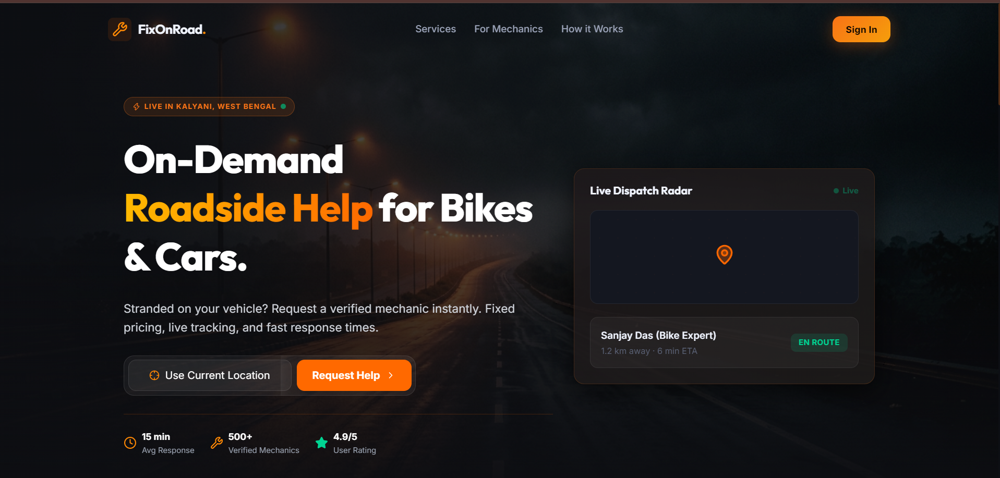
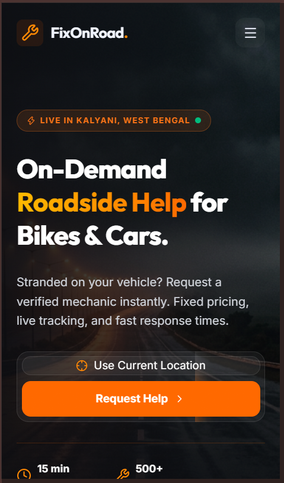
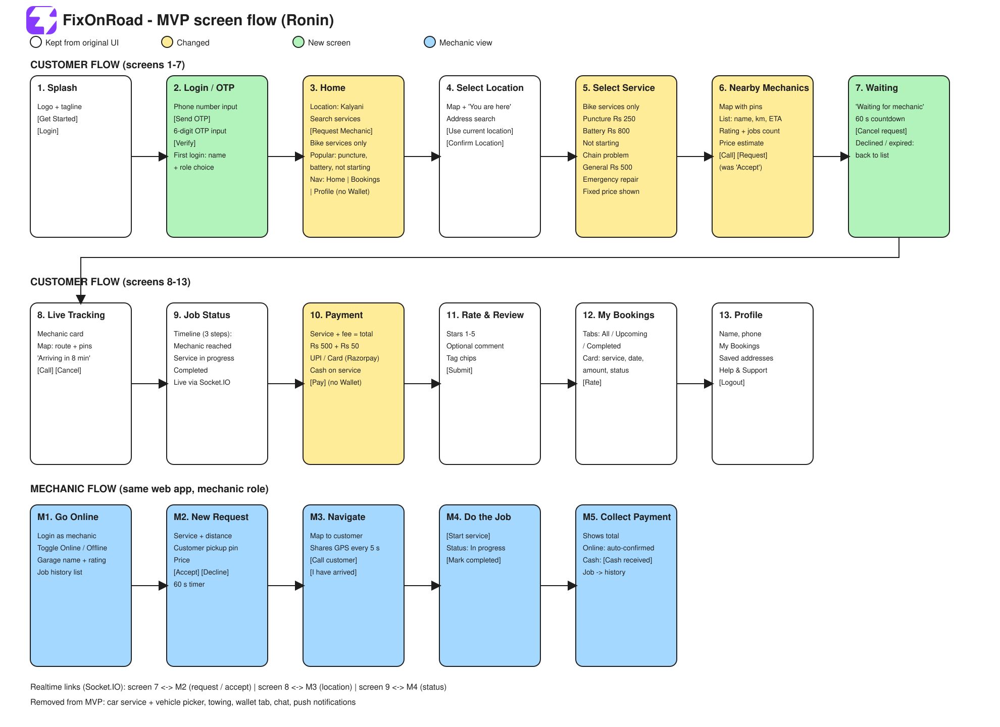

<div align="center">
  <h1>🛠️ FixOnRoad</h1>
  <p><strong>Two-Wheeler On-Demand Roadside Assistance</strong></p>

  <!-- Badges -->
  <p>
    
    
    
    
    <br/>
    
    
  </p>
</div>

---

## 🔗 Live Demo & Planning Docs
- **Live Demo URL:** [https://fixonroad.vercel.app](https://fixonroad.vercel.app)
- **Level 1 Ronin PRD:** [`./docs/01-PRD.md`](./docs/01-PRD.md)
- **Architecture Spec:** [`./docs/02-ARCHITECTURE.md`](./docs/02-ARCHITECTURE.md)

---

## Visual Design & UI Polish (25 pts)
- **Consistent Palette & Dark Mode:** Full implementation utilizing Tailwind CSS's `dark:` class strategy. The design gracefully toggles across all components without flash or flicker.
- **Typography & Spacing:** Strictly adheres to a standard 4px/8px modular scale. The baseline font size is fixed at `16px` (1rem) for maximum accessibility on mobile devices.
- **Skeletons & Empty States:** Implemented comprehensive skeleton loaders for the garage lists and interactive processing states for all button actions. Includes a dedicated empty state UI for "Zero Search Results".

## Core Features & Data Source (25 pts)
1. **Interactive Service Catalog & Garage Locator:** Users utilize a location picker to discover nearby garages.
2. **Booking State Machine & Request Simulation:** Robust multi-step interactive flow simulating `Request Help` ➔ `Searching` ➔ `Accepted` ➔ `Live Status Timeline`.
3. **Dynamic Pricing & Checkout:** Breakdown of labor/parts costs with a payment mode selector.
- **Real Data Connection:** Fed by local structured JSON mock databases and dynamic client-side React state.
- **Graceful Error Handling:** Simulates network fallback UIs if the request times out or is rejected, and features client-side form validation for payments.

## Responsiveness & Animation (20 pts)
- **Responsive Layout:** The layout leverages CSS Grid and Flexbox to guarantee a fully fluid responsive experience scaling flawlessly from **375px** (mobile) to **1280px+** (desktop).
- **Purposeful Micro-interactions:** Smooth 60fps animations for staggered fade-ups, UI scaling, and responsive hover states to guide user focus.

### Screenshots

<br/>

<br/>

<br/>


## Level 1 PRD Alignment (15 pts)
The project remains incredibly faithful to the original Level 1 Ronin plan, prioritizing the core rider/mechanic matching flow.

**Documented Scope Drift:**
- *Authentication:* Replaced Full OAuth with Client-side Session Mocking to prioritize UI layout.
- *Map Integration:* Replaced Live Google Maps SDK with static localized distances to avoid 3rd-party API overhead during the frontend evaluation.
- *Database:* Replaced MongoDB with local JSON structures to ensure 100% reliable evaluation uptime.
- *Real-time Chat:* Replaced WebSockets with a pre-defined "Status Updates" timeline.

## Deployment, Code & README (15 pts)
- **Working Live Demo:** Deployment successful and accessible via the link at the top.
- **Clean Repo & Working Setup Steps:**
  ```bash
  # 1. Clone the repository and navigate to the client folder
  git clone <your-repo-url>
  cd client

  # 2. Install all node dependencies
  npm install

  # 3. Start the Vite development server
  npm run dev
  ```
- **Honest Learnings:** We isolated UI components early on to make implementing Dark Mode and Skeleton Loaders significantly easier. Relying on React Context instead of Redux kept the bundle size small. Leveraging Tailwind's JIT compiler resulted in an incredibly small final CSS payload, contributing to near-instant First Contentful Paint (FCP).
