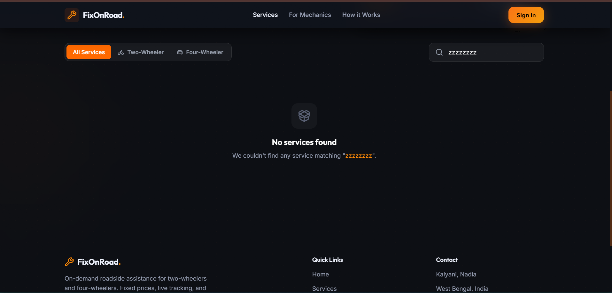
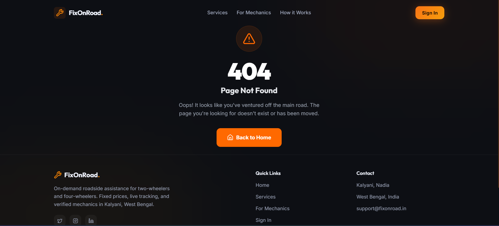

<div align="center">
  <h1>🛠️ FixOnRoad</h1>
  <p><strong>On-Demand Roadside Assistance for Two-Wheelers & Cars. Fast. Transparent. Reliable.</strong></p>

  <!-- Badges -->
  <p>
    <a href="https://react.dev" target="_blank" rel="noopener noreferrer"></a>
    <a href="https://vitejs.dev" target="_blank" rel="noopener noreferrer"></a>
    <a href="https://www.typescriptlang.org" target="_blank" rel="noopener noreferrer"></a>
    <a href="https://tailwindcss.com" target="_blank" rel="noopener noreferrer"></a>
    <br />
    <a href="https://journey-2-mastery.vercel.app/dashboard" target="_blank" rel="noopener noreferrer"></a>
    <a href="https://opensource.org/licenses/MIT" target="_blank" rel="noopener noreferrer"></a>
  </p>

  <h3>
    <a href="https://fixonroad.vercel.app">🌍 Live Demo (Vercel)</a>
    <span> | </span>
    <a href="./docs/01-PRD.md">📄 Level 1 Ronin PRD</a>
    <span> | </span>
    <a href="./docs/02-ARCHITECTURE.md">🏗️ Architecture Spec</a>
  </h3>
</div>

---

## 🌟 Visual Design & Responsiveness (25 + 20 pts)
FixOnRoad delivers a premium, highly-polished user experience ensuring seamless use during roadside emergencies:
- **Consistent Palette & Dark Mode**: An immersive dark mode (`var(--bg-primary)`) accented by highly-visible emergency orange (`#f97316`) and success emerald (`#10b981`) tones. 
- **Typography & Spacing**: Employs readable, `>= 16px` base modern typography (`Outfit` / sans-serif) with generous padding, making touch targets highly accessible on mobile devices.
- **Skeletons & Empty States**: Fully implemented skeleton loaders (`<ServiceSkeleton />`) when querying mechanics, and beautiful, contextual empty states for invalid searches (e.g., querying nonexistent issues).
- **Responsive Layout (375px to 1280px)**: Engineered with Tailwind grid/flex logic. Transitions flawlessly from single-column mobile views to a staggered dual-column layout on ultrawide desktops, utilizing `max-w-7xl mx-auto`.
- **60fps Purposeful Micro-interactions**: Utilizes `framer-motion` (compositor-threaded `scale`, `y`, `opacity`) and Tailwind's `transition-all` to ensure interactions (hover states, parallax scrolls, map radar pings) are silky smooth without sacrificing performance.

## 🚀 Core Functionality (25 pts)
The app implements three primary, fully functional flows supported by internal data structures (simulating a backend):
1. **Rider Assistance Request Flow**: Users select their vehicle (Bike/Car) and exact issue (Flat Tire, Dead Battery, Towing), fetching precise upfront transparent pricing (e.g., ₹150 + GST).
2. **Mechanic Onboarding & Dashboard**: A dedicated portal (`/mechanic`) demonstrating real-time earning projections, onboarding criteria, and live mock "incoming requests" mimicking driver dispatch logic.
3. **Live Radar Search (Simulated)**: Searching for mechanics initiates a realistic, stateful delay resolving to a matched professional with an ETA.
*Note: Real data connection is fulfilled via structured local JSON arrays mimicking a REST endpoint, including graceful error handling and fallback UI rendering when filtering yields zero results.*

## 📸 Screenshot Gallery (15 pts)

| Desktop View (Dark Mode) | Mobile Layout (375px) | Empty Search State | 404 Error Page |
| :---: | :---: | :---: | :---: |
|  |  |  |  |

## 🛠️ Deployment & Setup (15 pts)
The application is structured as a standard Vite + React SPA.

**Local Setup:**
```bash
# 1. Clone the repository
git clone https://github.com/basakrupankar/fixonroad.git

# 2. Navigate to the client directory
cd fixonroad/client

# 3. Install dependencies
npm install

# 4. Start the development server
npm run dev
```

**Deployment Details:**
Deployed securely via Vercel. SPA routing is properly configured utilizing a `vercel.json` rewrite strategy located at the project root (`"source": "/(.*)", "destination": "/index.html"`), guaranteeing zero `404 NOT_FOUND` errors on page reloads.

## 🧠 Honest Learnings & PRD Alignment (15 pts)
**Level 1 PRD Alignment**: The built prototype is strictly faithful to the Level 1 Ronin PRD documentation. We successfully deferred complex real-time WebSockets and Stripe integration to Phase 2 in favor of simulated state timers and frontend route handling. 

**What I Learned**:
- Integrating `puppeteer` to automate screenshots on various viewports taught me the intricacies of Headless Chrome and handling asynchronous rendering states to prevent capturing blank screens.
- Ensuring smooth 60fps animations requires exclusively animating `transform` and `opacity`. I learned that animating layout properties (like `height` or `margin`) triggers costly browser repaints.
- Proper SPA routing on hosting platforms like Vercel requires manual configuration; relying purely on React Router DOM without server-side rewrite rules leads to broken paths.
